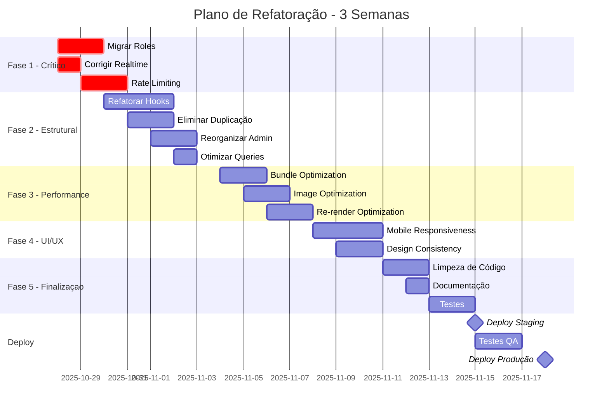

# 🔧 PLANO DE REFATORAÇÃO E OTIMIZAÇÃO DO SISTEMA

> **Data:** 27/10/2025  
> **Baseado em:** Auditoria Técnica Completa  
> **Objetivo:** Refatorar, otimizar e limpar código mantendo 100% da funcionalidade  
> **Prazo Estimado:** 2-3 semanas (60-80 horas)

---

## 📋 ÍNDICE

1. [Visão Geral](#visão-geral)
2. [Fase 1 - Correções Críticas](#fase-1-correções-críticas-blockers)
3. [Fase 2 - Otimizações Estruturais](#fase-2-otimizações-estruturais)
4. [Fase 3 - Melhorias de Performance](#fase-3-melhorias-de-performance)
5. [Fase 4 - Refinamento UI/UX](#fase-4-refinamento-uiux)
6. [Fase 5 - Limpeza e Documentação](#fase-5-limpeza-e-documentação)
7. [Checklist de Validação](#checklist-de-validação)

---

## 📊 VISÃO GERAL

### Nota Atual: 72/100
### Meta: 90+/100

### Problemas Identificados por Severidade

| Severidade | Quantidade | Tempo Estimado |
|------------|------------|----------------|
| 🔴 Crítico (Blocker) | 3 | 16h |
| 🟠 Alto (Importante) | 8 | 24h |
| 🟡 Médio | 12 | 20h |
| 🟢 Baixo | 15 | 10h |
| **TOTAL** | **38** | **70h** |

---

<a name="fase-1-correções-críticas-blockers"></a>
## 🚨 FASE 1 - CORREÇÕES CRÍTICAS (BLOCKERS)

**Prazo:** 2-3 dias  
**Prioridade:** MÁXIMA  
**Impacto:** Segurança e Estabilidade

---

### 1.1. 🔐 MIGRAR ROLES PARA TABELA SEPARADA

**Problema:** Roles armazenadas em `profiles.role` permitem privilege escalation.

**Impacto:** 🔴 CRÍTICO - Vulnerabilidade de Segurança  
**Tempo:** 6h  
**Dificuldade:** Alta

#### Passos de Implementação

**1.1.1. Criar Migração SQL**

```sql
-- ========================
-- MIGRATION: Criar Sistema de Roles Seguro
-- ========================

-- Criar enum de roles
CREATE TYPE public.app_role AS ENUM ('admin', 'attendant', 'customer');

-- Criar tabela user_roles
CREATE TABLE public.user_roles (
  id UUID PRIMARY KEY DEFAULT gen_random_uuid(),
  user_id UUID NOT NULL REFERENCES auth.users(id) ON DELETE CASCADE,
  role app_role NOT NULL,
  assigned_at TIMESTAMP WITH TIME ZONE DEFAULT now(),
  assigned_by UUID REFERENCES auth.users(id),
  UNIQUE(user_id, role)
);

-- Criar índice para performance
CREATE INDEX idx_user_roles_user_id ON public.user_roles(user_id);

-- Habilitar RLS
ALTER TABLE public.user_roles ENABLE ROW LEVEL SECURITY;

-- Policy: Usuários podem ver suas próprias roles
CREATE POLICY "Users can view own roles"
  ON public.user_roles
  FOR SELECT
  USING (auth.uid() = user_id);

-- Policy: Apenas admins podem inserir/atualizar roles
CREATE POLICY "Only admins can manage roles"
  ON public.user_roles
  FOR ALL
  USING (
    EXISTS (
      SELECT 1 FROM public.user_roles
      WHERE user_id = auth.uid() AND role = 'admin'
    )
  );

-- ========================
-- SECURITY DEFINER FUNCTIONS
-- ========================

-- Função para verificar role específica
CREATE OR REPLACE FUNCTION public.has_role(_user_id UUID, _role app_role)
RETURNS BOOLEAN
LANGUAGE sql
STABLE
SECURITY DEFINER
SET search_path = public
AS $$
  SELECT EXISTS (
    SELECT 1 FROM public.user_roles
    WHERE user_id = _user_id AND role = _role
  )
$$;

-- Função para verificar múltiplas roles
CREATE OR REPLACE FUNCTION public.has_any_role(_user_id UUID, _roles app_role[])
RETURNS BOOLEAN
LANGUAGE sql
STABLE
SECURITY DEFINER
SET search_path = public
AS $$
  SELECT EXISTS (
    SELECT 1 FROM public.user_roles
    WHERE user_id = _user_id AND role = ANY(_roles)
  )
$$;

-- Função para obter role principal do usuário
CREATE OR REPLACE FUNCTION public.get_user_role(_user_id UUID)
RETURNS app_role
LANGUAGE sql
STABLE
SECURITY DEFINER
SET search_path = public
AS $$
  SELECT role FROM public.user_roles
  WHERE user_id = _user_id
  ORDER BY 
    CASE role
      WHEN 'admin' THEN 1
      WHEN 'attendant' THEN 2
      WHEN 'customer' THEN 3
    END
  LIMIT 1
$$;

-- ========================
-- MIGRAR DADOS EXISTENTES
-- ========================

-- Inserir roles existentes na nova tabela
INSERT INTO public.user_roles (user_id, role)
SELECT id, role::app_role 
FROM public.profiles
WHERE role IS NOT NULL
ON CONFLICT (user_id, role) DO NOTHING;

-- ========================
-- ATUALIZAR RLS POLICIES EXISTENTES
-- ========================

-- Exemplo: Atualizar policy de orders
DROP POLICY IF EXISTS "Users can view own orders" ON public.orders;
CREATE POLICY "Users can view own orders"
  ON public.orders
  FOR SELECT
  USING (
    user_id = auth.uid() OR
    public.has_any_role(auth.uid(), ARRAY['admin', 'attendant']::app_role[])
  );

-- Exemplo: Atualizar policy de products (admin only edit)
DROP POLICY IF EXISTS "Admins can manage products" ON public.products;
CREATE POLICY "Admins can manage products"
  ON public.products
  FOR ALL
  USING (public.has_role(auth.uid(), 'admin'));

-- ========================
-- REMOVER COLUNA ANTIGA (APÓS VALIDAÇÃO)
-- ========================
-- ⚠️ EXECUTAR APENAS APÓS CONFIRMAR QUE TUDO FUNCIONA
-- ALTER TABLE public.profiles DROP COLUMN role;
```

**1.1.2. Atualizar Hook useRole**

```typescript
// src/hooks/useRole.tsx
import { useQuery } from '@tanstack/react-query';
import { supabase } from '@/integrations/supabase/client';

type AppRole = 'admin' | 'attendant' | 'customer';

export const useRole = () => {
  const { data: roles, isLoading } = useQuery({
    queryKey: ['userRoles'],
    queryFn: async () => {
      const { data: { user } } = await supabase.auth.getUser();
      if (!user) return [];

      const { data, error } = await supabase
        .from('user_roles')
        .select('role')
        .eq('user_id', user.id);

      if (error) throw error;
      return data.map(r => r.role as AppRole);
    },
    staleTime: 5 * 60 * 1000, // 5 minutos
  });

  const hasRole = (role: AppRole) => roles?.includes(role) ?? false;
  const hasAnyRole = (checkRoles: AppRole[]) => 
    checkRoles.some(r => roles?.includes(r)) ?? false;

  const isAdmin = hasRole('admin');
  const isAttendant = hasRole('attendant');
  const isCustomer = hasRole('customer');

  // Role primária (ordem de prioridade)
  const primaryRole: AppRole | null = 
    isAdmin ? 'admin' : 
    isAttendant ? 'attendant' : 
    isCustomer ? 'customer' : 
    null;

  return {
    roles: roles ?? [],
    hasRole,
    hasAnyRole,
    isAdmin,
    isAttendant,
    isCustomer,
    primaryRole,
    isLoading,
  };
};
```

**1.1.3. Atualizar Todos os Componentes que Usam Role**

```typescript
// Buscar e substituir em todo o projeto:

// ❌ ANTES
const { data: profile } = useQuery(['profile'], async () => {
  const { data } = await supabase
    .from('profiles')
    .select('role')
    .single();
  return data;
});
const isAdmin = profile?.role === 'admin';

// ✅ DEPOIS
import { useRole } from '@/hooks/useRole';
const { isAdmin, isLoading } = useRole();
```

**Arquivos a serem atualizados:**
- `src/routes/ProtectedRoute.tsx`
- `src/routes/AttendantRoute.tsx`
- `src/hooks/auth/useAuth.tsx`
- `src/providers/SubscriptionProvider.tsx`
- Todos os componentes admin que verificam role

---

### 1.2. 🔄 CORRIGIR REALTIME DUPLICADO

**Problema:** Múltiplas subscrições Realtime causam crashes ao mudar status de pedidos.

**Impacto:** 🔴 CRÍTICO - Estabilidade  
**Tempo:** 4h  
**Dificuldade:** Média

#### Passos de Implementação

**1.2.1. Criar Hook Unificado de Realtime**

```typescript
// src/hooks/useUnifiedRealtime.tsx
import { useEffect, useRef, useState } from 'react';
import { supabase } from '@/integrations/supabase/client';
import { RealtimeChannel } from '@supabase/supabase-js';

type RealtimeTable = 'orders' | 'order_items' | 'products' | 'messages';
type RealtimeCallback = (payload: any) => void;

export const useUnifiedRealtime = (
  table: RealtimeTable,
  filter: { column: string; value: any } | null = null,
  callback: RealtimeCallback
) => {
  const [isConnected, setIsConnected] = useState(false);
  const channelRef = useRef<RealtimeChannel | null>(null);
  const callbackRef = useRef(callback);

  // Atualizar callback sem recriar canal
  useEffect(() => {
    callbackRef.current = callback;
  }, [callback]);

  useEffect(() => {
    // Cleanup de canal anterior
    if (channelRef.current) {
      supabase.removeChannel(channelRef.current);
      channelRef.current = null;
    }

    // Criar nome único do canal
    const channelName = filter 
      ? `${table}-${filter.column}-${filter.value}`
      : `${table}-all`;

    console.log(`[Realtime] Conectando ao canal: ${channelName}`);

    // Criar novo canal
    const channel = supabase
      .channel(channelName)
      .on(
        'postgres_changes',
        {
          event: '*',
          schema: 'public',
          table: table,
          ...(filter && { filter: `${filter.column}=eq.${filter.value}` }),
        },
        (payload) => {
          console.log(`[Realtime] ${table} evento:`, payload.eventType);
          callbackRef.current(payload);
        }
      )
      .subscribe((status) => {
        console.log(`[Realtime] ${channelName} status:`, status);
        setIsConnected(status === 'SUBSCRIBED');
      });

    channelRef.current = channel;

    // Cleanup ao desmontar
    return () => {
      console.log(`[Realtime] Desconectando de: ${channelName}`);
      if (channelRef.current) {
        supabase.removeChannel(channelRef.current);
        channelRef.current = null;
      }
      setIsConnected(false);
    };
  }, [table, filter?.column, filter?.value]);

  return { isConnected };
};
```

**1.2.2. Substituir Todos os Usos de Realtime**

```typescript
// ❌ ANTES - useRealtimeOrders.tsx
useEffect(() => {
  const channel = supabase
    .channel(`orders-${user.id}`)
    .on('postgres_changes', { ... }, callback)
    .subscribe();
  // ⚠️ Sem cleanup adequado
}, [user.id]);

// ✅ DEPOIS
import { useUnifiedRealtime } from '@/hooks/useUnifiedRealtime';

const { isConnected } = useUnifiedRealtime(
  'orders',
  { column: 'user_id', value: user?.id },
  (payload) => {
    queryClient.invalidateQueries(['orders', user?.id]);
  }
);
```

**Arquivos a serem refatorados:**
- `src/hooks/useRealtimeOrders.tsx` → Usar `useUnifiedRealtime`
- `src/hooks/useOrderChat.tsx` → Usar `useUnifiedRealtime`
- `src/providers/AttendantProvider.tsx` → Usar `useUnifiedRealtime`
- `src/services/realtime.ts` → Remover (redundante)
- `src/services/realtimeManager.ts` → Remover (redundante)

---

### 1.3. 🛡️ IMPLEMENTAR RATE LIMITING NAS EDGE FUNCTIONS

**Problema:** Edge Functions críticas estão expostas sem rate limiting.

**Impacto:** 🔴 CRÍTICO - Segurança e Custos  
**Tempo:** 6h  
**Dificuldade:** Média

#### Passos de Implementação

**1.3.1. Criar Tabela de Rate Limit**

```sql
-- Tabela para controlar rate limiting
CREATE TABLE public.rate_limits (
  id UUID PRIMARY KEY DEFAULT gen_random_uuid(),
  identifier TEXT NOT NULL, -- IP ou user_id
  endpoint TEXT NOT NULL,
  request_count INTEGER DEFAULT 1,
  window_start TIMESTAMP WITH TIME ZONE DEFAULT now(),
  created_at TIMESTAMP WITH TIME ZONE DEFAULT now(),
  UNIQUE(identifier, endpoint, window_start)
);

-- Índice para limpeza eficiente
CREATE INDEX idx_rate_limits_window_start ON public.rate_limits(window_start);

-- Função de limpeza automática (executar diariamente)
CREATE OR REPLACE FUNCTION public.cleanup_old_rate_limits()
RETURNS INTEGER
LANGUAGE plpgsql
SECURITY DEFINER
AS $$
DECLARE
  deleted_count INTEGER;
BEGIN
  DELETE FROM public.rate_limits
  WHERE window_start < now() - INTERVAL '1 hour';
  
  GET DIAGNOSTICS deleted_count = ROW_COUNT;
  RETURN deleted_count;
END;
$$;
```

**1.3.2. Criar Utilitário de Rate Limiting**

```typescript
// supabase/functions/_shared/rate-limiter.ts
import { createClient } from 'https://esm.sh/@supabase/supabase-js@2.50.0';

interface RateLimitConfig {
  maxRequests: number;
  windowMs: number;
  identifier: string;
  endpoint: string;
}

export async function checkRateLimit(
  supabaseClient: any,
  config: RateLimitConfig
): Promise<{ allowed: boolean; remaining: number; resetAt: Date }> {
  const { maxRequests, windowMs, identifier, endpoint } = config;
  const windowStart = new Date(Date.now() - windowMs);

  try {
    // Buscar ou criar registro
    const { data, error } = await supabaseClient
      .from('rate_limits')
      .select('request_count, window_start')
      .eq('identifier', identifier)
      .eq('endpoint', endpoint)
      .gte('window_start', windowStart.toISOString())
      .single();

    if (error && error.code !== 'PGRST116') {
      throw error;
    }

    if (!data) {
      // Primeiro request nesta janela
      await supabaseClient
        .from('rate_limits')
        .insert({
          identifier,
          endpoint,
          request_count: 1,
          window_start: new Date(),
        });

      return {
        allowed: true,
        remaining: maxRequests - 1,
        resetAt: new Date(Date.now() + windowMs),
      };
    }

    // Verificar limite
    if (data.request_count >= maxRequests) {
      const resetAt = new Date(new Date(data.window_start).getTime() + windowMs);
      return {
        allowed: false,
        remaining: 0,
        resetAt,
      };
    }

    // Incrementar contador
    await supabaseClient
      .from('rate_limits')
      .update({ request_count: data.request_count + 1 })
      .eq('identifier', identifier)
      .eq('endpoint', endpoint)
      .eq('window_start', data.window_start);

    return {
      allowed: true,
      remaining: maxRequests - data.request_count - 1,
      resetAt: new Date(new Date(data.window_start).getTime() + windowMs),
    };
  } catch (error) {
    console.error('Rate limit check error:', error);
    // Em caso de erro, permitir request (fail open)
    return { allowed: true, remaining: maxRequests, resetAt: new Date() };
  }
}

export function getRateLimitHeaders(result: {
  allowed: boolean;
  remaining: number;
  resetAt: Date;
}) {
  return {
    'X-RateLimit-Remaining': result.remaining.toString(),
    'X-RateLimit-Reset': result.resetAt.toISOString(),
    'Retry-After': result.allowed ? '0' : Math.ceil((result.resetAt.getTime() - Date.now()) / 1000).toString(),
  };
}
```

**1.3.3. Aplicar Rate Limiting em Funções Críticas**

```typescript
// supabase/functions/create-order-optimized/index.ts
import { checkRateLimit, getRateLimitHeaders } from '../_shared/rate-limiter.ts';

Deno.serve(async (req) => {
  // ... configuração inicial ...

  // Obter identificador (IP ou user_id)
  const identifier = user?.id || req.headers.get('x-forwarded-for') || 'anonymous';

  // Verificar rate limit: 10 pedidos por minuto por usuário
  const rateLimitResult = await checkRateLimit(supabaseAdmin, {
    maxRequests: 10,
    windowMs: 60 * 1000, // 1 minuto
    identifier,
    endpoint: 'create-order',
  });

  if (!rateLimitResult.allowed) {
    return new Response(
      JSON.stringify({
        success: false,
        error: 'Too many requests. Please try again later.',
      }),
      {
        status: 429,
        headers: {
          ...corsHeaders,
          'Content-Type': 'application/json',
          ...getRateLimitHeaders(rateLimitResult),
        },
      }
    );
  }

  // ... continuar processamento normal ...
});
```

**Funções a serem protegidas com Rate Limiting:**
- ✅ `create-order-optimized` - 10 req/min por user
- ✅ `create-order-with-pix` - 5 req/min por user
- ✅ `create-order-with-card` - 5 req/min por user
- ✅ `create-checkout` - 3 req/min por user
- ✅ `check-subscription` - 30 req/min por user
- ✅ `reconcile-subscription` - 1 req/5min por user

---

<a name="fase-2-otimizações-estruturais"></a>
## ⚙️ FASE 2 - OTIMIZAÇÕES ESTRUTURAIS

**Prazo:** 5-7 dias  
**Prioridade:** ALTA  
**Impacto:** Manutenibilidade e Clareza

---

### 2.1. 📦 REFATORAR HOOKS GIGANTES

**Problema:** Hooks com 200-700 linhas são difíceis de manter e testar.

**Impacto:** 🟠 Alto - Manutenibilidade  
**Tempo:** 8h  
**Dificuldade:** Média

#### 2.1.1. Quebrar `useAuth` (272 linhas)

**Estrutura Atual:**
```
useAuth (272 linhas)
├── Estado (user, session, loading)
├── signIn (48 linhas)
├── signUp (60 linhas)
├── signOut (52 linhas)
├── updateProfile (26 linhas)
└── isAuthenticated (3 linhas)
```

**Nova Estrutura:**
```typescript
// src/hooks/auth/useAuthState.tsx (40 linhas)
export const useAuthState = () => {
  const [user, setUser] = useState<User | null>(null);
  const [session, setSession] = useState<Session | null>(null);
  const [loading, setLoading] = useState(true);

  useEffect(() => {
    // Listener de auth state
    // Fetch initial session
  }, []);

  return { user, session, loading, setUser, setSession };
};

// src/hooks/auth/useAuthActions.tsx (150 linhas)
export const useAuthActions = () => {
  const { setUser, setSession } = useAuthState();
  
  const signIn = useCallback(async (email, password) => {
    // Lógica de sign in
  }, []);

  const signUp = useCallback(async (email, password, userData) => {
    // Lógica de sign up
  }, []);

  const signOut = useCallback(async () => {
    // Lógica de sign out
  }, []);

  const updateProfile = useCallback(async (data) => {
    // Lógica de update
  }, []);

  return { signIn, signUp, signOut, updateProfile };
};

// src/hooks/auth/useAuth.tsx (50 linhas) - Wrapper principal
export const useAuth = () => {
  const state = useAuthState();
  const actions = useAuthActions();
  
  const isAuthenticated = () => !!state.user && !!state.session;
  
  return {
    ...state,
    ...actions,
    isAuthenticated,
  };
};
```

#### 2.1.2. Quebrar `useSubscription` (282 linhas)

```typescript
// Nova estrutura modular:

// src/hooks/subscription/useSubscriptionState.tsx
// Estado e fetch básico (80 linhas)

// src/hooks/subscription/useSubscriptionCache.tsx  
// Lógica de cache e invalidação (60 linhas)

// src/hooks/subscription/useSubscriptionActions.tsx
// Refresh, reconcile, checkout (100 linhas)

// src/hooks/subscription/useSubscription.tsx
// Wrapper unificado (40 linhas)
```

---

### 2.2. 🗑️ ELIMINAR CÓDIGO DUPLICADO

**Problema:** QueryClient, realtime services e subscription hooks duplicados.

**Impacto:** 🟠 Alto - Confusão e Bugs  
**Tempo:** 4h  
**Dificuldade:** Baixa

#### Ações

**2.2.1. Consolidar QueryClient**

```typescript
// ❌ REMOVER: src/main.tsx (linha 9)
import { QueryClient, QueryClientProvider } from '@tanstack/react-query';
const queryClient = new QueryClient({...});

// ✅ MANTER APENAS: src/config/queryClient.ts
export const queryClient = new QueryClient({
  defaultOptions: {
    queries: {
      staleTime: 5 * 60 * 1000, // 5 min
      retry: 1,
      refetchOnWindowFocus: false,
    },
  },
});

// ✅ USAR EM: src/main.tsx
import { queryClient } from '@/config/queryClient';
```

**2.2.2. Consolidar Serviços Realtime**

```typescript
// ❌ REMOVER:
- src/services/realtime.ts
- src/services/realtimeManager.ts

// ✅ MANTER APENAS:
- src/hooks/useUnifiedRealtime.tsx (criado na Fase 1)
```

**2.2.3. Consolidar Hooks de Subscription**

```typescript
// ❌ REMOVER:
- useSubscriptionContext (de SubscriptionProvider)

// ✅ MANTER:
- useSubscription (hooks/useSubscription.tsx)
- useUnifiedAuth (que engloba subscription)

// ✅ ATUALIZAR: Todos os componentes para usar apenas useUnifiedAuth
import { useUnifiedAuth } from '@/hooks/useUnifiedAuth';
const { subscription, hasValidSubscription } = useUnifiedAuth();
```

---

### 2.3. 🎯 DELETAR PÁGINAS REDUNDANTES

**Problema:** ExpressCheckout é redundante com Checkout.

**Impacto:** 🟡 Médio - Confusão  
**Tempo:** 2h  
**Dificuldade:** Baixa

#### Ações

```typescript
// 1. Deletar arquivos
❌ DELETE: src/pages/ExpressCheckout.tsx

// 2. Remover rota de App.tsx
❌ REMOVER: 
<Route path="/express-checkout" element={<ExpressCheckout />} />

// 3. Atualizar redirecionamentos
// Buscar por "express-checkout" em todo o projeto e substituir por "/checkout"
```

---

### 2.4. 📁 REORGANIZAR ESTRUTURA DE ADMIN

**Problema:** 25 páginas admin causam navegação confusa.

**Impacto:** 🟡 Médio - UX  
**Tempo:** 6h  
**Dificuldade:** Média

#### Nova Estrutura Proposta

```
pages/admin/
├── index.tsx                    [Dashboard Principal]
├── pedidos/
│   ├── index.tsx               [Lista de Pedidos]
│   └── [id].tsx                [Detalhes do Pedido]
├── cardapio/
│   ├── produtos.tsx            [Gerenciar Produtos]
│   ├── categorias.tsx          [Gerenciar Categorias]
│   └── extras.tsx              [Gerenciar Extras]
├── clientes/
│   ├── index.tsx               [Lista de Clientes]
│   ├── segmentos.tsx           [Segmentação]
│   └── fidelidade.tsx          [Programa de Fidelidade]
├── marketing/
│   ├── campanhas.tsx           [Campanhas]
│   ├── cupons.tsx              [Cupons]
│   └── promocoes.tsx           [Promoções]
├── relatorios/
│   ├── vendas.tsx              [Relatório de Vendas]
│   ├── produtos.tsx            [Produtos Mais Vendidos]
│   └── clientes.tsx            [Análise de Clientes]
└── configuracoes/
    ├── loja.tsx                [Configurações da Loja]
    ├── delivery.tsx            [Zonas de Entrega]
    ├── pagamento.tsx           [Métodos de Pagamento]
    ├── usuarios.tsx            [Gerenciar Usuários]
    └── integracoes.tsx         [Integrações Externas]
```

**Consolidações:**
- `gerenciar-app/produtos` + `produtos` → `cardapio/produtos`
- `dashboard/Receitas` + `relatorios/Vendas` → `relatorios/vendas`
- `configuracoes/*` + `gerenciar-app/*` → `configuracoes/*`

---

### 2.5. 🔧 OTIMIZAR QUERIES REACT QUERY

**Problema:** Queries sem staleTime causam refetches desnecessários.

**Impacto:** 🟡 Médio - Performance  
**Tempo:** 4h  
**Dificuldade:** Baixa

#### Configurações Recomendadas

```typescript
// src/config/query.ts
export const queryConfig = {
  // Dados que mudam raramente (10 min)
  static: {
    staleTime: 10 * 60 * 1000,
    cacheTime: 30 * 60 * 1000,
  },
  // Dados normais (5 min)
  normal: {
    staleTime: 5 * 60 * 1000,
    cacheTime: 15 * 60 * 1000,
  },
  // Dados em tempo real (30 seg)
  realtime: {
    staleTime: 30 * 1000,
    cacheTime: 60 * 1000,
  },
};

// Exemplos de uso:
// Products (muda raramente) → static
useQuery({
  queryKey: ['products'],
  queryFn: fetchProducts,
  ...queryConfig.static,
});

// Orders (muda frequentemente) → realtime
useQuery({
  queryKey: ['orders', userId],
  queryFn: fetchOrders,
  ...queryConfig.realtime,
});

// Subscription (verificação cached) → normal
useQuery({
  queryKey: ['subscription', userId],
  queryFn: checkSubscription,
  ...queryConfig.normal,
});
```

---

<a name="fase-3-melhorias-de-performance"></a>
## 🚀 FASE 3 - MELHORIAS DE PERFORMANCE

**Prazo:** 4-5 dias  
**Prioridade:** MÉDIA  
**Impacto:** Performance e UX

---

### 3.1. 📦 OTIMIZAR BUNDLE SIZE

**Objetivo:** Reduzir de 2.5MB para < 1.5MB

**Impacto:** 🟡 Médio - Carregamento  
**Tempo:** 6h  
**Dificuldade:** Média

#### 3.1.1. Configurar Manual Chunks no Vite

```typescript
// vite.config.ts
export default defineConfig({
  build: {
    rollupOptions: {
      output: {
        manualChunks: {
          // React core
          'react-vendor': ['react', 'react-dom', 'react-router-dom'],
          
          // UI components
          'ui-vendor': [
            '@radix-ui/react-dialog',
            '@radix-ui/react-dropdown-menu',
            '@radix-ui/react-select',
            '@radix-ui/react-tabs',
          ],
          
          // Charts (lazy load)
          'charts': ['recharts'],
          
          // Supabase
          'supabase': ['@supabase/supabase-js'],
          
          // React Query
          'query': ['@tanstack/react-query'],
          
          // Forms
          'forms': ['react-hook-form', 'zod'],
        },
      },
    },
    chunkSizeWarningLimit: 1000, // KB
  },
});
```

#### 3.1.2. Lazy Load Componentes Pesados

```typescript
// src/App.tsx - Adicionar lazy loading onde falta

// ✅ Já implementado
const Dashboard = lazy(() => import('./pages/Dashboard'));

// ❌ Faltando - ADICIONAR:
const AdminCatalog = lazy(() => import('./pages/AdminCatalog'));
const AdminStock = lazy(() => import('./pages/AdminStock'));
const Analytics = lazy(() => import('./pages/Analytics'));
const IntegrationsManager = lazy(() => import('./pages/IntegrationsManager'));
const LoadTest = lazy(() => import('./pages/LoadTest'));

// Charts (usar apenas quando necessário)
const RevenueChart = lazy(() => import('./components/RevenueChart'));
```

#### 3.1.3. Lazy Load Dependências Grandes

```typescript
// Mercado Pago (200KB) - Carregar apenas no checkout
// ❌ ANTES: import { MercadoPago } from '@mercadopago/sdk-js';

// ✅ DEPOIS:
const loadMercadoPago = async () => {
  const { MercadoPago } = await import('@mercadopago/sdk-js');
  return new MercadoPago(publicKey);
};

// QR Code - Carregar apenas quando necessário
const generateQRCode = async (data: string) => {
  const QRCode = await import('qrcode');
  return QRCode.toDataURL(data);
};
```

---

### 3.2. 🖼️ OTIMIZAR IMAGENS

**Problema:** Imagens sem lazy loading e sem otimização.

**Impacto:** 🟡 Médio - Carregamento  
**Tempo:** 4h  
**Dificuldade:** Baixa

#### 3.2.1. Implementar Lazy Loading de Imagens

```typescript
// src/components/OptimizedImage.tsx
import { useState, useEffect, useRef } from 'react';

interface OptimizedImageProps {
  src: string;
  alt: string;
  className?: string;
  placeholder?: string;
}

export const OptimizedImage = ({ 
  src, 
  alt, 
  className = '',
  placeholder = '/placeholder.svg'
}: OptimizedImageProps) => {
  const [imageSrc, setImageSrc] = useState(placeholder);
  const [isLoading, setIsLoading] = useState(true);
  const imgRef = useRef<HTMLImageElement>(null);

  useEffect(() => {
    const observer = new IntersectionObserver(
      (entries) => {
        entries.forEach((entry) => {
          if (entry.isIntersecting) {
            setImageSrc(src);
            observer.disconnect();
          }
        });
      },
      { rootMargin: '50px' } // Pré-carregar 50px antes de aparecer
    );

    if (imgRef.current) {
      observer.observe(imgRef.current);
    }

    return () => observer.disconnect();
  }, [src]);

  return (
     setIsLoading(false)}
    />
  );
};
```

#### 3.2.2. Substituir Imagens nos Componentes

```typescript
// MenuCard.tsx, ProductCard.tsx, etc.
// ❌ ANTES:


// ✅ DEPOIS:
import { OptimizedImage } from '@/components/OptimizedImage';
<OptimizedImage src={product.image_url} alt={product.name} />
```

---

### 3.3. ⚡ OTIMIZAR RE-RENDERS

**Problema:** Componentes re-renderizam desnecessariamente.

**Impacto:** 🟡 Médio - Performance  
**Tempo:** 6h  
**Dificuldade:** Média

#### 3.3.1. Usar React.memo em Componentes de Lista

```typescript
// src/components/MenuCard.tsx
import { memo } from 'react';

export const MenuCard = memo(({ product, onAddToCart }) => {
  return (
    // ... JSX
  );
}, (prevProps, nextProps) => {
  // Re-render apenas se product.id ou onAddToCart mudarem
  return prevProps.product.id === nextProps.product.id &&
         prevProps.onAddToCart === nextProps.onAddToCart;
});
```

#### 3.3.2. Usar useCallback em Handlers

```typescript
// Dashboard.tsx
// ❌ ANTES:
const handleOrderClick = (orderId) => {
  // ... lógica
};

// ✅ DEPOIS:
const handleOrderClick = useCallback((orderId: string) => {
  // ... lógica
}, []); // Dependências corretas
```

#### 3.3.3. Usar useMemo para Cálculos Pesados

```typescript
// OrderStatus.tsx
// ❌ ANTES:
const totalItems = order.items.reduce((sum, item) => sum + item.quantity, 0);

// ✅ DEPOIS:
const totalItems = useMemo(
  () => order.items.reduce((sum, item) => sum + item.quantity, 0),
  [order.items]
);
```

---

### 3.4. 🔄 IMPLEMENTAR VIRTUALIZAÇÃO

**Problema:** Listas grandes (>50 itens) causam lag.

**Impacto:** 🟡 Médio - Performance  
**Tempo:** 4h  
**Dificuldade:** Média

#### Implementação

```typescript
// src/hooks/useVirtualization.tsx - JÁ EXISTE!
// ✅ Aplicar em:

// 1. AttendantUnified - Lista de pedidos
import { useVirtualization } from '@/hooks/useVirtualization';

const AttendantUnified = () => {
  const { data: orders } = useOrders();
  
  const virtualizedOrders = useVirtualization({
    items: orders,
    itemHeight: 80, // Altura de cada linha
    containerHeight: 600, // Altura da área visível
  });
  
  return (
    <div style={{ height: '600px', overflow: 'auto' }}>
      {virtualizedOrders.map(order => (
        <OrderRow key={order.id} order={order} />
      ))}
    </div>
  );
};

// 2. AdminOrdersTable - Tabela de pedidos admin
// 3. AdminProductsList - Lista de produtos
// 4. Menu - Lista de produtos (se > 50 produtos)
```

---

<a name="fase-4-refinamento-uiux"></a>
## 🎨 FASE 4 - REFINAMENTO UI/UX

**Prazo:** 3-4 dias  
**Prioridade:** MÉDIA  
**Impacto:** Experiência do Usuário

---

### 4.1. 📱 CORRIGIR RESPONSIVIDADE MOBILE

**Problema:** Várias telas quebram em mobile.

**Impacto:** 🟡 Médio - UX Mobile  
**Tempo:** 8h  
**Dificuldade:** Média

#### Páginas a Corrigir

**4.1.1. Checkout**

```typescript
// src/pages/Payment.tsx
// ❌ Problema: Resumo lateral some em mobile

// ✅ Solução:
<div className="grid grid-cols-1 lg:grid-cols-3 gap-6">
  {/* Formulário - 2 colunas em desktop */}
  <div className="lg:col-span-2">
    <CheckoutForm />
  </div>
  
  {/* Resumo - sticky em desktop, fixed bottom em mobile */}
  <div className="lg:col-span-1">
    <div className="lg:sticky lg:top-4">
      {/* Desktop: sidebar normal */}
      <div className="hidden lg:block">
        <OrderSummary />
      </div>
      
      {/* Mobile: fixed bottom */}
      <div className="lg:hidden fixed bottom-0 left-0 right-0 bg-background border-t p-4 z-50">
        <OrderSummaryCompact />
      </div>
    </div>
  </div>
</div>
```

**4.1.2. Admin Sidebar**

```typescript
// src/components/AppSidebar.tsx
// ❌ Problema: Sidebar sobrepõe conteúdo em mobile

// ✅ Solução: Usar Sheet do Shadcn em mobile
import { Sheet, SheetContent, SheetTrigger } from '@/components/ui/sheet';

const AppSidebar = () => {
  return (
    <>
      {/* Desktop: Sidebar normal */}
      <aside className="hidden lg:block w-64 border-r">
        <SidebarContent />
      </aside>
      
      {/* Mobile: Sheet (drawer) */}
      <Sheet>
        <SheetTrigger asChild className="lg:hidden">
          <Button variant="ghost" size="icon">
            <Menu />
          </Button>
        </SheetTrigger>
        <SheetContent side="left" className="w-64">
          <SidebarContent />
        </SheetContent>
      </Sheet>
    </>
  );
};
```

**4.1.3. Menu de Produtos**

```typescript
// src/components/MenuCard.tsx
// ❌ Problema: Cards muito grandes em mobile

// ✅ Solução:
<div className="grid grid-cols-1 sm:grid-cols-2 lg:grid-cols-3 xl:grid-cols-4 gap-4">
  {products.map(product => (
    <Card key={product.id} className="flex flex-col">
      {/* Imagem responsiva */}
      <div className="aspect-square w-full overflow-hidden">
        <OptimizedImage src={product.image_url} alt={product.name} />
      </div>
      
      {/* Conteúdo com padding adequado */}
      <CardContent className="flex-1 p-4">
        <h3 className="text-base md:text-lg font-semibold line-clamp-2">
          {product.name}
        </h3>
        <p className="text-sm text-muted-foreground line-clamp-3 mt-2">
          {product.description}
        </p>
      </CardContent>
    </Card>
  ))}
</div>
```

---

### 4.2. 🎨 PADRONIZAR TOKENS SEMÂNTICOS

**Problema:** Uso inconsistente de cores diretas vs tokens.

**Impacto:** 🟡 Médio - Consistência  
**Tempo:** 4h  
**Dificuldade:** Baixa

#### Buscar e Substituir

```bash
# Buscar usos incorretos:
grep -r "text-white" src/
grep -r "bg-white" src/
grep -r "text-black" src/
grep -r "bg-black" src/
grep -r "text-gray-" src/
grep -r "bg-orange-" src/

# Substituir por tokens semânticos:
text-white       → text-primary-foreground
bg-white         → bg-background
text-black       → text-foreground
bg-gray-50       → bg-muted
text-gray-600    → text-muted-foreground
bg-orange-500    → bg-primary
text-orange-600  → text-primary
```

---

### 4.3. 🧭 SIMPLIFICAR NAVEGAÇÃO ADMIN

**Problema:** Menu com 25 itens é confuso.

**Impacto:** 🟡 Médio - UX Admin  
**Tempo:** 4h  
**Dificuldade:** Baixa

#### Nova Estrutura de Menu

```typescript
// src/components/AppSidebar.tsx
const menuSections = [
  {
    title: 'Visão Geral',
    items: [
      { icon: Home, label: 'Dashboard', href: '/admin' },
      { icon: Package, label: 'Pedidos', href: '/admin/pedidos' },
    ],
  },
  {
    title: 'Cardápio',
    items: [
      { icon: UtensilsCrossed, label: 'Produtos', href: '/admin/cardapio/produtos' },
      { icon: Tag, label: 'Categorias', href: '/admin/cardapio/categorias' },
      { icon: Plus, label: 'Extras', href: '/admin/cardapio/extras' },
    ],
  },
  {
    title: 'Clientes',
    items: [
      { icon: Users, label: 'Lista', href: '/admin/clientes' },
      { icon: Target, label: 'Segmentos', href: '/admin/clientes/segmentos' },
      { icon: Gift, label: 'Fidelidade', href: '/admin/clientes/fidelidade' },
    ],
  },
  {
    title: 'Marketing',
    collapsible: true, // Seção colapsável
    items: [
      { icon: Megaphone, label: 'Campanhas', href: '/admin/marketing/campanhas' },
      { icon: Ticket, label: 'Cupons', href: '/admin/marketing/cupons' },
      { icon: Percent, label: 'Promoções', href: '/admin/marketing/promocoes' },
    ],
  },
  {
    title: 'Relatórios',
    collapsible: true,
    items: [
      { icon: TrendingUp, label: 'Vendas', href: '/admin/relatorios/vendas' },
      { icon: BarChart3, label: 'Produtos', href: '/admin/relatorios/produtos' },
      { icon: Users, label: 'Clientes', href: '/admin/relatorios/clientes' },
    ],
  },
  {
    title: 'Configurações',
    collapsible: true,
    items: [
      { icon: Store, label: 'Loja', href: '/admin/configuracoes/loja' },
      { icon: Truck, label: 'Delivery', href: '/admin/configuracoes/delivery' },
      { icon: CreditCard, label: 'Pagamento', href: '/admin/configuracoes/pagamento' },
      { icon: Users, label: 'Usuários', href: '/admin/configuracoes/usuarios' },
      { icon: Puzzle, label: 'Integrações', href: '/admin/configuracoes/integracoes' },
    ],
  },
];
```

---

<a name="fase-5-limpeza-e-documentação"></a>
## 🧹 FASE 5 - LIMPEZA E DOCUMENTAÇÃO

**Prazo:** 2-3 dias  
**Prioridade:** BAIXA  
**Impacto:** Manutenibilidade

---

### 5.1. 🗑️ REMOVER ARQUIVOS SEM USO

**Impacto:** 🟢 Baixo - Organização  
**Tempo:** 2h  
**Dificuldade:** Baixa

#### Arquivos a Revisar

```bash
# Buscar arquivos não importados:
npx depcheck

# Revisar manualmente:
report/                          # Mover para /docs
src/pages/LoadTest.tsx          # Remover em produção
src/components/SubscriptionDebugger.tsx  # Remover em produção
src/pages/SubscriptionDebug.tsx # Remover em produção
```

---

### 5.2. 📝 DOCUMENTAR CÓDIGO CRÍTICO

**Impacto:** 🟢 Baixo - Manutenibilidade  
**Tempo:** 4h  
**Dificuldade:** Baixa

#### Arquivos Prioritários

```typescript
// src/hooks/useSubscription.tsx
/**
 * Hook para gerenciar assinatura do usuário
 * 
 * Cache Strategy:
 * 1. Verifica cache local (staleTime: 5min)
 * 2. Verifica DB Supabase
 * 3. Se necessário, valida com Stripe
 * 
 * @returns {Object} subscription - Dados da assinatura
 * @returns {boolean} hasValidSubscription - Se assinatura está ativa
 * @returns {Function} refreshSubscription - Força atualização
 */
export const useSubscription = () => {
  // ...
};

// supabase/functions/create-order-optimized/index.ts
/**
 * Edge Function: Criar Pedido Otimizado
 * 
 * Fluxo:
 * 1. Validar autenticação
 * 2. Reservar estoque atomicamente
 * 3. Criar pedido
 * 4. Processar pagamento
 * 5. Confirmar estoque
 * 
 * Rate Limit: 10 requests/min por usuário
 * Timeout: 30s
 */
Deno.serve(async (req) => {
  // ...
});
```

---

### 5.3. 🧪 ADICIONAR TESTES BÁSICOS

**Impacto:** 🟢 Baixo - Qualidade  
**Tempo:** 8h  
**Dificuldade:** Alta

#### Setup de Testes

```bash
# Instalar Vitest
npm install -D vitest @testing-library/react @testing-library/jest-dom
```

```typescript
// src/hooks/__tests__/useAuth.test.tsx
import { renderHook, waitFor } from '@testing-library/react';
import { useAuth } from '../auth/useAuth';

describe('useAuth', () => {
  it('should initialize with loading state', () => {
    const { result } = renderHook(() => useAuth());
    expect(result.current.loading).toBe(true);
  });

  it('should authenticate user with valid credentials', async () => {
    const { result } = renderHook(() => useAuth());
    
    await waitFor(() => {
      result.current.signIn('test@example.com', 'password123');
    });
    
    expect(result.current.user).toBeDefined();
    expect(result.current.isAuthenticated()).toBe(true);
  });
});

// Testes prioritários:
// ✅ useAuth - Autenticação
// ✅ useSubscription - Verificação de assinatura
// ✅ useRole - Verificação de roles
// ✅ useCart - Gerenciamento de carrinho
```

---

<a name="checklist-de-validação"></a>
## ✅ CHECKLIST DE VALIDAÇÃO

### Fase 1 - Crítico ✅
- [ ] Migração de roles para `user_roles` completa
- [ ] Função `has_role()` criada e testada
- [ ] Todas as policies atualizadas
- [ ] Hook `useRole` funcionando
- [ ] Realtime unificado implementado
- [ ] Todos os canais com cleanup adequado
- [ ] Rate limiting em 6 edge functions críticas
- [ ] Tabela `rate_limits` criada
- [ ] Testes de carga aprovados (< 429 errors)

### Fase 2 - Estrutural ✅
- [ ] `useAuth` quebrado em 3 hooks menores
- [ ] `useSubscription` modularizado
- [ ] QueryClient consolidado (apenas 1 instância)
- [ ] Serviços de realtime consolidados
- [ ] ExpressCheckout deletado
- [ ] Rotas admin reorganizadas (12 rotas finais)
- [ ] Queries com `staleTime` configurado

### Fase 3 - Performance ✅
- [ ] Manual chunks configurado no Vite
- [ ] Bundle < 1.5MB (gzipped)
- [ ] Lazy loading em 5+ componentes adicionais
- [ ] OptimizedImage implementado
- [ ] 20+ imagens com lazy loading
- [ ] React.memo em componentes de lista
- [ ] useCallback em handlers críticos
- [ ] Virtualização em 3 listas grandes

### Fase 4 - UI/UX ✅
- [ ] Checkout mobile responsivo
- [ ] Admin sidebar com drawer mobile
- [ ] Menu de produtos responsivo
- [ ] Tokens semânticos (0 usos de `text-white`)
- [ ] Menu admin com 6 seções colapsáveis
- [ ] Breadcrumbs implementados

### Fase 5 - Limpeza ✅
- [ ] Arquivos de report movidos para /docs
- [ ] Debug pages removidas (ou protegidas)
- [ ] Código crítico documentado
- [ ] 5+ testes unitários implementados
- [ ] Lint warnings < 10
- [ ] TypeScript `strict: true`

---

## 🎯 MÉTRICAS DE SUCESSO

| Métrica | Antes | Meta | Impacto |
|---------|-------|------|---------|
| **Bundle Size** | 2.5MB | < 1.5MB | -40% |
| **Lighthouse Score** | 65 | > 85 | +20pts |
| **Time to Interactive** | 4.5s | < 2.5s | -44% |
| **Vulnerabilidades** | 3 críticas | 0 | 100% |
| **Code Duplication** | 15% | < 5% | -10% |
| **TypeScript Coverage** | 85% | > 95% | +10% |
| **Component Size (média)** | 180 linhas | < 120 linhas | -33% |
| **Nota Auditoria** | 72/100 | > 90/100 | +18pts |

---

## 📊 CRONOGRAMA FINAL



---

## 🚀 PRÓXIMOS PASSOS

1. **Revisar este plano** com a equipe
2. **Priorizar fases** conforme urgência do negócio
3. **Criar branches** para cada fase
4. **Executar Fase 1** imediatamente (crítico)
5. **Validar em staging** após cada fase
6. **Deploy gradual** (10% → 50% → 100% usuários)

---

## 📞 SUPORTE

Para dúvidas sobre implementação:
- **Arquitetura:** Revisar `report/AUDITORIA_TECNICA_COMPLETA.md`
- **Dados Técnicos:** Revisar `report/REESTRUTURACAO_TECNICA.md`
- **Migrations:** Testar em staging antes de produção

---

**🎉 Boa refatoração! Qualquer dúvida, estou aqui para ajudar.**
